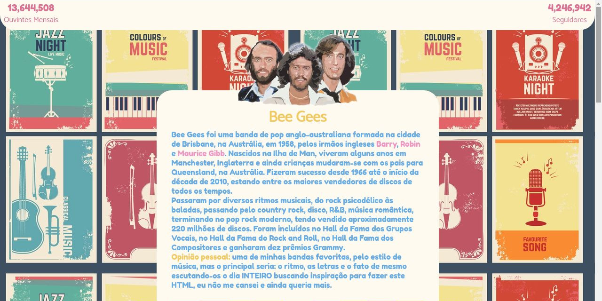
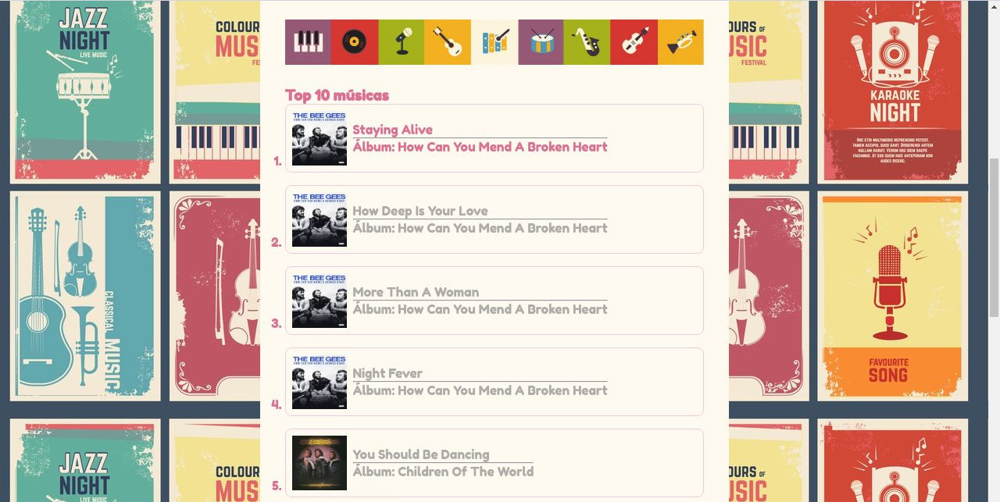
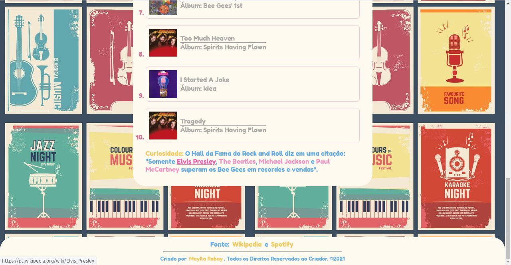

<h1 align="center">
  
</h1>

<h2 align="center"> 
	🚀 Banda Favorita 🚀
</h2>

## 💻 Sobre o projeto
  Site com algumas curiosidades sobre minha banda favorita e suas top 10 músicas. Criado para melhorar meu conhecimento em HTML e CSS. Segue as instruções para praticar:

    Você deverá criar uma página com no minímo os seguintes elementos:

    - Uma imagem da banda/artista favorito
    - Um título com o nome da banda/artista
    - Um parágrafo contando um pouco sobre a banda/artista e por que ela é sua favorita, as informações da banda podem ser tiradas do wikipedia/spotify/etc, você deve apenas preencher o motivo de sua preferência
    - Uma lista ordenada do ranking das músicas desta banda/artista
    - Cada item da lista deve conter um link do spotify/youtube/soundcloud/etc da música e dentro do link a capa do álbum (imagem) e nome da música e do álbum 

    A ordem apresentada acima deve ser a mesma na página.

    Você deverá criar um arquivo separado (index.css) para estilizar, pelo menos, os seguintes elementos:

    - A cor dos textos (não precisam ser todos iguais, porém pelo menos 1 elemento h1, h2, p, etc deve ter sua cor modificada)
    - A fonte dos textos 
    - O tamanho das fontes
    - O alinhamento horizontal dos textos
    - A cor ou imagem de fundo do body

    Seja criativo e não limite-se aos estilos obrigatórios, tente mudar o estilo da lista, dos links, etc.

## 🎨 Layout
  Design próprio, com imagens retiradas da internet e editadas no GIMP. Cores utilizadas:
  - floralwhite (tom de branco)
  - rgb(173, 172, 169) (cinza)
  - palevioletred (rosa pálido)
  - rgba(221, 0, 129, 0.4) (tom de rosa mais claro)
  - rgba(221, 0, 129, 0.6) (tom de rosa mais escuro)
  - rgba(233, 168, 0, 0.6) (amarelo)
  - rgba(0, 120, 223, 0.6) (azul)

## 🛠 Tecnologias
  - 
  - 

Feito com ❤️ por Maylla Rabay 👋 [Entre em contato!](https://www.linkedin.com/in/mayllarabay/)

